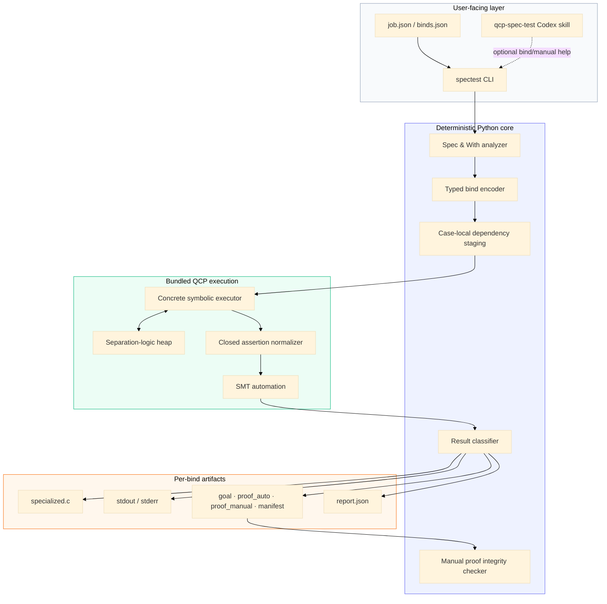

<div align="center">

# TeSpec

### Concrete specification testing for QCP-annotated C

把一份 **C implementation + QCP spec** 和一组具体 **binds**，
转化为可追溯的 `PASS / FAIL / UNKNOWN / ERROR` 测试结果。

[](https://www.python.org/)
[](https://coq.inria.fr/)
[](#可信边界)
[](#可信边界)

[`快速开始`](#快速开始) ·
[`Binds`](#binds输入) ·
[`执行流程`](#执行流程) ·
[`完整文档`](docs/usage-reference.md)

</div>

---

TeSpec 面向“给定具体测试输入，检查这次执行是否满足函数 spec”的场景。
它不是把测试伪装成全称验证：每个 bind 都独立执行、独立生成 VC、独立报告结果。

核心框架不调用大模型。模型只可在框架之外帮助填写 binds，或为明确标记为
manual 的 residual VC 编写 Coq 证明。

## 执行流程

```mermaid
%%{init: {"theme": "base", "themeVariables": {
  "fontFamily": "Inter, ui-sans-serif, system-ui",
  "primaryColor": "#EEF2FF",
  "primaryTextColor": "#172554",
  "primaryBorderColor": "#6366F1",
  "lineColor": "#64748B",
  "secondaryColor": "#ECFDF5",
  "tertiaryColor": "#FFF7ED"
}}}%%
flowchart LR
    A["C implementation<br/>+ QCP spec"]:::input
    B["binds.json<br/>args · values · types"]:::input

    A --> C["Analyze<br/>发现 C 参数与 With 变量"]:::engine
    B --> D["Specialize<br/>注入具体绑定"]:::engine
    C --> D

    D --> E["Concrete symbolic execution<br/>执行函数体、循环与 callee"]:::engine
    E --> F["Heap evolution<br/>数组 · 结构体 · 单/双链表"]:::memory
    F --> G["Closed AST normalization<br/>Zlength · Znth · 逻辑连接词 · 有界量词"]:::solver
    G --> H["QCP strategies + SMT"]:::solver

    H -->|全部 VC 关闭| P["PASS"]:::pass
    H -->|确定矛盾| Q["FAIL"]:::fail
    H -->|路径/深度上限| U["UNKNOWN"]:::unknown
    H -->|Residual VC| R["proof_manual.v"]:::manual
    R --> S["Human / model proof<br/>spectest check-proof"]:::manual
    S -->|Coq 8.20 kernel accepts| M["Manual proof PASS"]:::pass
    S -->|未证明| U

    classDef input fill:#F8FAFC,stroke:#94A3B8,color:#0F172A,stroke-width:1.5px;
    classDef engine fill:#EEF2FF,stroke:#6366F1,color:#312E81,stroke-width:1.5px;
    classDef memory fill:#F0FDFA,stroke:#14B8A6,color:#134E4A,stroke-width:1.5px;
    classDef solver fill:#EFF6FF,stroke:#3B82F6,color:#1E3A8A,stroke-width:1.5px;
    classDef pass fill:#ECFDF5,stroke:#10B981,color:#065F46,stroke-width:2px;
    classDef fail fill:#FEF2F2,stroke:#EF4444,color:#991B1B,stroke-width:2px;
    classDef unknown fill:#FFF7ED,stroke:#F97316,color:#9A3412,stroke-width:2px;
    classDef manual fill:#FAF5FF,stroke:#A855F7,color:#6B21A8,stroke-width:1.5px;
```



### 具体执行语义

- 顶层函数的全部 C 参数和 required value-level `With` 都必须具体绑定。
- 有函数体的 callee 直接执行真实函数体，不使用 callee spec；callee 参数由调用点自动建立。
- 有限 `while / for / do-while` 不要求循环不变式，每轮计算闭合条件并剪枝。
- 数组、闭合结构体、单链表、双链表及其递归组合共享同一套 heap。
- 执行结束后仍检查目标函数原始 `Ensure`，不会因为“程序跑完”就自动判定 PASS。

## 快速开始

### 1. 环境

仓库自带 Linux x86-64 的修改版 QCP 执行器、通用 QCIP headers/strategies 和
Coq runtime：

```bash
git clone https://github.com/taylor-swift-13/TeSpec.git
cd TeSpec
python3 -m pip install -e .
scripts/check-runtime.sh
```

最低要求：

| 用途 | 依赖 |
|---|---|
| 分析和运行 spec tests | Linux x86-64、glibc、Python 3.10+ |
| 检查 manual residual proof | Coq 8.20.x |
| 重新构建执行器 | QCP source、CMake、C compiler |

### 2. 分析 spec

```bash
python3 -m spectest analyze SOURCE.c \
  --function FUNCTION
```

输出会区分：

- `argument_bindings`：目标函数的 C 输入；
- `value_bindings`：value-level `With`；
- type-level `With {A}`：需要时通过 `types` 指定 Coq 类型实例。

### 3. 填写 binds

```json
[
  {
    "id": "empty",
    "args": {"state": 4096, "data_length": 0, "area_length": 8, "force": 0},
    "values": {"l": [2, 3, 0]}
  },
  {
    "id": "wrap_and_force",
    "args": {"state": 8192, "data_length": 3, "area_length": 8, "force": 1},
    "values": {"l": [1, 7, 0]}
  }
]
```

### 4. 运行

```bash
python3 -m spectest run SOURCE.c \
  --function FUNCTION \
  --binds binds.json \
  --loop-unroll-limit 64 \
  --call-depth-limit 64 \
  --output-dir .spectest/my-run
```

已有 job：

```bash
python3 -m spectest check cases/callee_heap/job.json
```

## Binds输入

| 区域 | 绑定对象 | 友好输入 |
|---|---|---|
| `args` | 顶层 C 形参 | 整数、布尔、具体指针地址、QCP expression |
| `values` | value-level `With` | `Z`、`bool`、嵌套 list、constructor tree、raw QCP term |
| `types` | type-level `With {A}` | `option Z`、`list Z` 或任意合法 Coq 类型 |

常用形式：

```json
{
  "integer": -7,
  "list": [1, 2, 3],
  "nested_list": [[1, 2], [], [3]],
  "constructor": {"ctor": "Some", "args": [9], "type_args": ["Z"]},
  "typed_raw": {"type": "addr_avl_tree", "qcp": "avl_node_model(...)"},
  "large_unread_heap": {"symbolic": true}
}
```

指针使用具体数值地址。不同且不可别名的对象使用不同地址；只有测试故意要求别名时
才复用同一地址。callee 不需要也不接受单独的 binds。

更多格式见 [完整使用参考](docs/usage-reference.md) 和
[binds skill reference](skills/qcp-spec-test/references/binds.md)。

## 状态解释

| 状态 | 含义 |
|---|---|
| `PASS` | QCP/SMT 已关闭该 bind 的全部 VC |
| `FAIL` | QCP 得到确定不一致 obligation，说明该具体执行不满足 spec |
| `UNKNOWN` | residual VC 或执行深度上限；不能解释为 PASS 或 FAIL |
| `ERROR` | binds、parser、环境、超时或工具配置错误 |

QCP/SMT 未关闭的目标写入 `vc/manifest.json` 和 `proof_manual.v`：

```bash
python3 -m spectest check-proof PATH/TO/vc/manifest.json
```

检查器拒绝 `Admitted`、`Abort`、新公理等 proof escape，并使用 Coq 8.20
内核检查完整证明。

## 组件边界



## 可信边界

TeSpec 只有一种核心自动证明来源：

> 通用 QCP assertion 归约后，由 QCP strategies / SMT 接受并写入
> `proof_auto.v`。

核心没有二级 `coq_auto`，不会恢复特定 witness、按案例枚举、选择固定 Coq
分支或填写 `proof_manual.v`。模型生成的 residual proof 即使通过 Coq 内核，
来源仍标记为 manual。

## 支持范围

- 标量、指针、数组和数组切片；
- 闭合结构体及结构体字段内数组；
- 任意 QCP `Let` 分离谓词；
- 有策略定义的 `Extern Coq` predicate；
- 单链表、双链表与数组/结构体的递归组合；
- 有限循环、嵌套循环、函数调用和有限递归；
- `Z`、`bool`、嵌套 `list`、多态类型和任意 constructor tree；
- 整数与当前 QCP store 支持的闭合浮点路径。

当前优先支持数组、闭合结构体、单/双链表及其组合；树和一般图不属于当前承诺范围。
完整 assertion 语法见 [QCP assertion coverage](docs/qcp-assertion-coverage.md)。

## 项目结构

```text
TeSpec/
├── bin/qcp-symexec          # 修改版 QCP concrete executor
├── spectest/                # Python analyzer、bind encoder、runner
├── runtime/qcip/            # 通用 QCP/QCIP + Coq runtime
├── cases/                   # 自包含回归案例及各自领域依赖
├── skills/qcp-spec-test/    # Codex binds/manual-proof 工作流
├── scripts/                 # 构建、runtime 检查、corpus 回归
├── tests/                   # 端到端回归
└── docs/                    # 详细说明与语法覆盖
```

## 回归状态

```bash
python3 -m unittest discover -s tests -v
python3 scripts/run-cav-memory-suite.py
```

- 本地端到端测试：49 项通过；纯仓库环境中 1 项外部 xizi corpus
  探测会按设计 skip；
- CAV memory suite：20 个程序、54 组 binds；
- QCP/SMT 自动 PASS：35；
- manual residual：19；
- `FAIL / ERROR / unexpected UNKNOWN`：0。

CAV runner 保留 10% manual-rate 硬门禁。当前仅使用 QCP/SMT 时手动率为
35.19%，因此该门禁会故意返回非零；这是可见的覆盖缺口，不会通过特定 Coq tactic
隐藏。

## 开发

重新构建并安装修改版 QCP：

```bash
QCP_SOURCE_DIR=/path/to/sac_c_parser \
  scripts/build-qcp-symexec.sh
```

更新 bundled QCIP runtime：

```bash
QCIP_SOURCE_DIR=/path/to/QCIP \
  scripts/vendor-qcip-runtime.sh
```

详细执行语义、job schema、residual VC 和 corpus 数据见
[docs/usage-reference.md](docs/usage-reference.md)。

---

<div align="center">
<sub>Concrete tests, explicit proof provenance, no hidden model calls.</sub>
</div>
