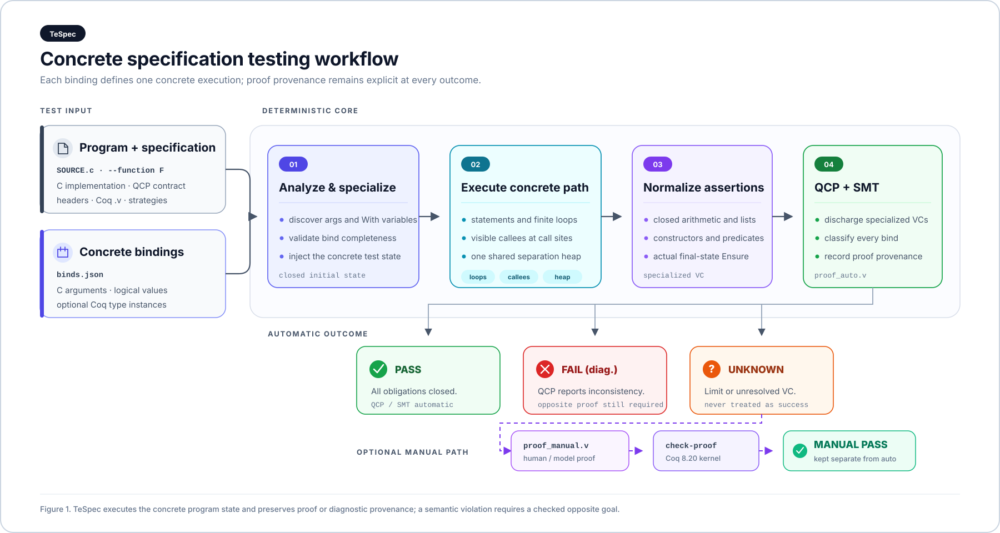
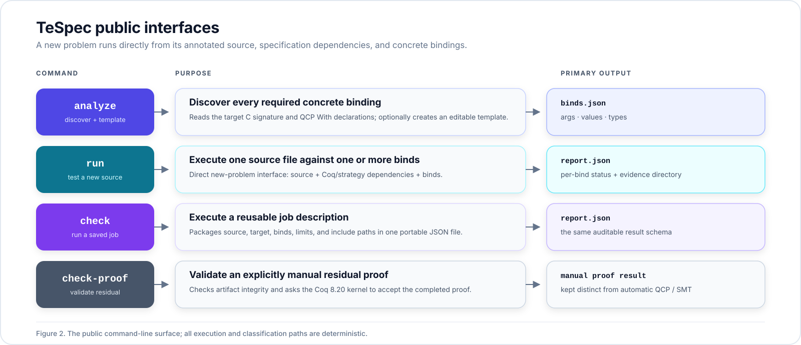

<div align="center">

# TeSpec

### Concrete specification testing for QCP-annotated C

输入 **C implementation + QCP spec**、spec 引用的 **Coq definitions /
strategies** 和具体 **binds**，直接得到逐测试用例的
`PASS / FAIL / UNKNOWN / ERROR`。

[](https://www.python.org/)
[](https://coq.inria.fr/)
[](#结果解释)
[](#结果解释)

[`测试一道新题`](#测试一道新题) ·
[`命令行接口`](#命令行接口) ·
[`Binds`](#binds-输入) ·
[`完整参考`](docs/usage-reference.md)

</div>

---

TeSpec 检查的是：

> 在这一组具体 C 参数和逻辑变量绑定下，真实执行目标函数后得到的终态是否满足
> 原始 `Ensure`。

每个 bind 是一条独立测试用例。框架会执行有限循环、可见 callee 和相关 heap
读写；不要求循环不变式，也不要求填写 callee binds。核心执行、VC 归约、结果分类
均不调用大模型。

## 使用流程

<p align="center">
  
</p>

<p align="center">
  <a href="docs/assets/tespec-workflow.svg">SVG</a> ·
  <a href="docs/assets/tespec-workflow.pdf">PDF</a>
</p>

图中的每条路径都对应一个具体 bind。程序执行结束后，TeSpec 仍使用实际终态检查
目标函数的原始后置条件；“程序能够运行结束”本身不等于 `PASS`。

## 快速开始

```bash
git clone https://github.com/taylor-swift-13/TeSpec.git
cd TeSpec
python3 -m pip install -e .
scripts/check-runtime.sh
```

运行 spec test 需要 Linux x86-64、glibc 和 Python 3.10+。只有检查 manual
residual proof 时需要 Coq 8.20.x。

## 测试一道新题

新题不需要复制到 `cases/`，也不需要登记或修改项目文件。准备包含目标
implementation 与 QCP spec 的 C 文件；如果 spec 导入了 Coq 模块或 strategy，
同时提供这些依赖文件。

推荐把一道新题组织成：

```text
my-problem/
├── SOURCE.c
├── predicates.h                  # 可选：QCP declarations / Let definitions
├── predicates.strategies         # 可选：QCP strategy rules
└── dependencies/coq/
    └── Logical/Module.v          # 可选：Import Coq 对应的逻辑模块路径
```

例如源码包含 `Import Coq Require Import Logical.Module` 时，对应文件放在
`dependencies/coq/Logical/Module.v`。其传递导入也按逻辑模块路径保存；工具会
递归发现并复制到每个 bind 的 VC 目录。

### 1. 自动发现需要绑定的变量

```bash
python3 -m spectest analyze /path/to/SOURCE.c \
  --function FUNCTION \
  --write-binds binds.json
```

`analyze` 会列出：

- `argument_bindings`：目标函数的全部 C 形参；
- `value_bindings`：spec 中需要具体化的 value-level `With`；
- type-level `With {A}`：需要具体类型实例时填入 `types`。

如果同一函数有多个 full spec，添加 `--spec SPEC_NAME`。如果 QCP declaration
或 `include strategies` 位于其他目录，可重复传入 `-I INCLUDE_DIR`。

### 2. 填入具体测试输入

编辑刚生成的 `binds.json`。一个文件可以放任意多条测试：

```json
[
  {
    "id": "no_wrap",
    "args": {
      "state": 4096,
      "data_length": 2,
      "area_length": 8,
      "force": 0
    },
    "values": {
      "l": [1, 3, 0]
    }
  },
  {
    "id": "wrap_and_force",
    "args": {
      "state": 8192,
      "data_length": 3,
      "area_length": 8,
      "force": 1
    },
    "values": {
      "l": [1, 7, 0]
    }
  }
]
```

顶层函数的全部 C 参数必须出现在 `args`。执行所需的 heap 由具体指针参数、
`values` 和 `Require` 一起物化；callee 的参数在调用点自动计算。

### 3. 直接运行

```bash
python3 -m spectest run /path/to/SOURCE.c \
  --function FUNCTION \
  --binds binds.json \
  --output-dir .spectest/my-run
```

有限循环或递归较深时，可显式调整安全上限：

```bash
python3 -m spectest run /path/to/SOURCE.c \
  --function FUNCTION \
  --binds binds.json \
  --loop-unroll-limit 128 \
  --call-depth-limit 128 \
  --timeout 60
```

命令会在终端打印逐 bind 结果，并在输出目录保存 `report.json`、特化后的
`specialized.c`、QCP 日志和对应 VC 证据。

## 命令行接口

<p align="center">
  
</p>

<p align="center">
  <a href="docs/assets/tespec-interfaces.svg">SVG</a> ·
  <a href="docs/assets/tespec-interfaces.pdf">PDF</a>
</p>

| 接口 | 用途 |
|---|---|
| `analyze SOURCE --function F [--spec S]` | 分析 spec，并可用 `--write-binds` 生成模板 |
| `run SOURCE --function F --binds binds.json [-I DIR]` | 直接测试一道新题及其本地依赖 |
| `check job.json` | 运行已保存、可复用的 job |
| `check-proof vc/manifest.json` | 检查已填写的 manual residual Coq 证明 |

查看任意接口的完整选项：

```bash
python3 -m spectest analyze --help
python3 -m spectest run --help
python3 -m spectest check --help
python3 -m spectest check-proof --help
```

## Binds 输入

| 区域 | 绑定对象 | 支持的友好输入 |
|---|---|---|
| `args` | 顶层 C 形参 | 整数、布尔、具体指针地址、原始 QCP expression |
| `values` | value-level `With` | `Z`、`bool`、嵌套 list、constructor tree、raw QCP term |
| `types` | type-level `With {A}` | `option Z`、`list Z` 或任意合法 Coq 类型 |

常用逻辑值：

```json
{
  "integer": -7,
  "list": [1, 2, 3],
  "nested_list": [[1, 2], [], [3]],
  "constructor": {"ctor": "Some", "args": [9], "type_args": ["Z"]},
  "typed_raw": {"type": "addr_avl_tree", "qcp": "avl_node_model(...)"},
  "large_unread_heap": {"symbolic": true}
}
```

构造子可以递归嵌套，因此 `option`、pair、tree 和用户自定义 inductive 不需要
Python 预先认识。无法唯一推断的任意 Coq 类型可以使用显式 `type + qcp` 形式。

指针使用具体数值地址。不同且不可别名的对象应使用不同地址；只有测试故意要求
别名时才复用地址。更多格式见
[binds reference](skills/qcp-spec-test/references/binds.md)。

## 结果解释

| 状态 | 含义 |
|---|---|
| `PASS` | QCP/SMT 已关闭该 bind 的全部 VC |
| `FAIL` | 某个具体 obligation 确定为假，该执行不满足 spec |
| `UNKNOWN` | 存在 residual VC，或达到循环/调用深度上限；绝不视为成功 |
| `ERROR` | binds、parser、依赖、超时或运行环境错误 |

自动证明只来自通用 assertion 归约与 QCP/SMT，保存为 `proof_auto.v`。核心没有
二级 `coq_auto`，也不会自动填写 `proof_manual.v`。

`Import Coq` 引入的 `.v` 文件提供逻辑定义和证明环境；它不自动等价于可执行的
heap 规则。自定义 separation predicate 如果使用 QCP `Let` 定义，可以直接展开；
如果只用 `Extern Coq` 声明，还必须提供相应 strategy，执行器不会猜测其内存布局。

如果产生 residual VC，可由人或模型填写 manifest 指定的 manual proof，再运行：

```bash
python3 -m spectest check-proof .spectest/my-run/CASE/vc/manifest.json
```

检查器会拒绝 `Admitted`、`Abort`、新增公理等 proof escape，并通过 Coq 8.20
内核检查证明。manual 结果始终与 QCP/SMT 自动证明分开标记。

## 支持的测试对象

- 标量、指针、数组和数组切片；
- 闭合结构体及其字段内数组；
- QCP `Let` 分离谓词；
- 有策略定义的 `Extern Coq` predicate；
- 单链表、双链表与数组/结构体的递归组合；
- 有限循环、嵌套循环、函数调用和有限递归；
- `Z`、`bool`、嵌套 `list`、多态类型和任意 constructor tree；
- 整数与当前 QCP store 支持的闭合浮点路径。

当前承诺范围以数组、闭合结构体、单/双链表及其组合为主；树和一般图暂不在承诺
范围内。完整 assertion 语法见
[QCP assertion coverage](docs/qcp-assertion-coverage.md)。

## 模型辅助（可选）

仓库内的 [qcp-spec-test skill](skills/qcp-spec-test/SKILL.md) 可以驱动 Codex：

- 根据 `analyze` 结果帮助选择和填写 binds；
- 诊断 `FAIL / UNKNOWN`；
- 为 residual VC 编写明确标记为 manual 的 Coq 证明。

人已经填写的 binds 会原样保留。模型不参与核心执行和自动结果分类。

完整 job schema、执行语义与证据文件说明见
[使用参考](docs/usage-reference.md)。

---

<div align="center">
<sub>Concrete tests · explicit proof provenance · no hidden model calls</sub>
</div>
